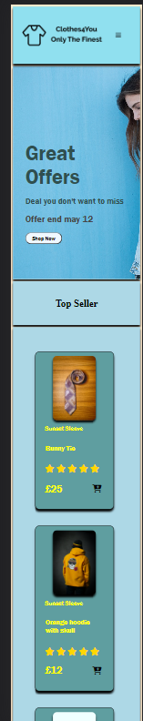
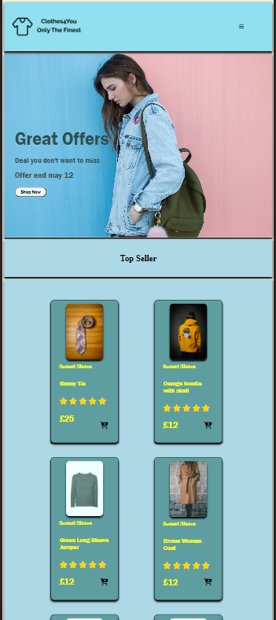
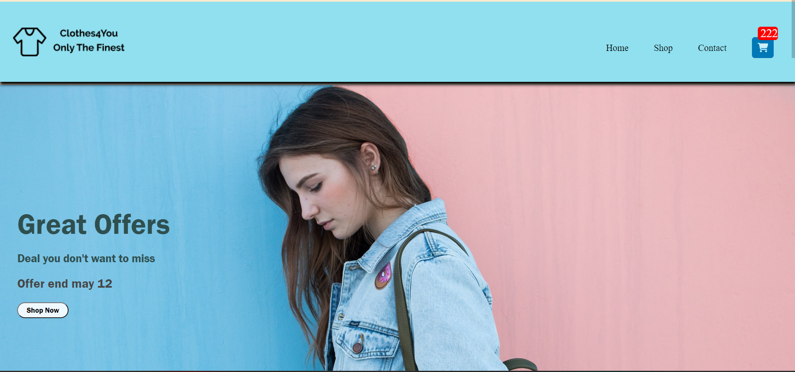

# Clothes4You - E-Commerce Site

## About My Site

Clothes4You is an e-commerce website. It has 4 distinct pages. Page 1 is the home page. Page 2 is the Shop page. Page 3 is the Contact Us page. The last page is the Cart Page. The Clothes4You e-commerce site is based on clothing products for all ages to look at however, when buying the products from the site user will need to have a valid bank detail to purchase the clothes. The products shown on the website is a mix of picture and text taken from an [API](https://fakestoreapi.com/) and other product picture taken from a free-to-use website. The website has been tested in chrome browser.

## Structure of Html Pages

Each page has a header, a main body, and a footer. The header contains my nav bar and logo. The main body contains the main content the page is for page and the footer contains contact information and social platform links.

## Responsiveness

The e-commerce website is responsive for all sizes starting from small screen devices up to 320 pixels. In smaller screen devices most content is shown one below another. If there is a product card that will all be in a single column.

### Small Screen

### Large Screen

## User Interface

Users can Press on the cart icon in the product cart and this will increase the counter on the cart icon on the nav bar showing an item was added to the cart. The Data is saved in local storage and called throughout the page allowing people to see how many items are in the cart. Users can fill out a form on the contact page and this will trigger an alert to show form has been submitted. Each input is validated to make sure the user put in the correct input. On the Cart, page User can input their bank detail which is validated to make sure correct input is given, and then process the detail and show a message showing payment is confirmed. Users can also use the discount code **12AB34CD** to get a 10% discount on items.

### What feature was not achived

I was gonna have a search feature which would have search through the api for input user wanted to see and would have showed the result however due to my mix approach this feature was taken out.

## References

1. Making my [sticky-navBar](https://www.w3schools.com/cssref/pr_pos_z-index.php) follow the scroll going down
2. [Generate-FakeNumber](https://randommer.io/Phone) give a fake number really quickly
3. [Product&Banner-Images-1](https://pixabay.com/) banner, offer and product picture where taken from here
4. [Product&Banner-Images-2](https://unsplash.com/s/photos/hoodie) banner, offer and product picture where taken from here
5. [Font-Styles](https://fonts.google.com/) Google font was used to take customer font style
6. [Input-Validation](https://regexr.com/) regrex was used to make custome validation to allow certain input to work
7. [API](https://fakestoreapi.com/) where my product in shop page is taken from.
8. [Speech-Bubble](https://codingislove.com/css-speech-bubbles/) Used to make notification of _Added item to cart_
9. [font-awesome](https://fontawesome.com/) used for icon throught the website
10. [menu-bar](https://www.youtube.com/watch?v=LsyvuEegVA4) used to learn how a slding menu bar works and implemented in my own way
